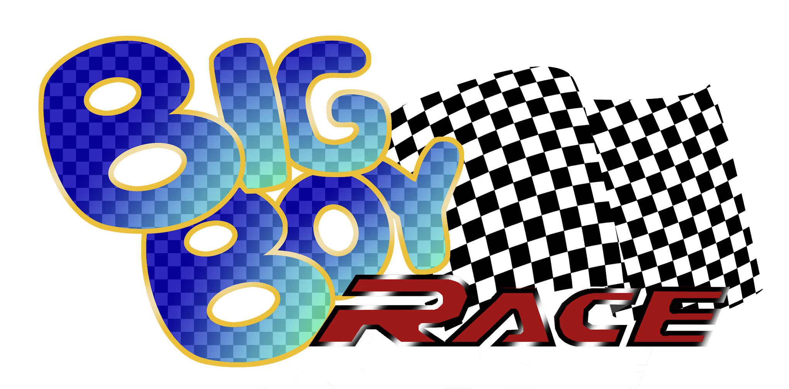

# BigBoyRace

Un jeu créé par :
- ABET Jean-Baptiste
- BOUTIN Azarias
- KAINDOH Tommy
- MOCKELS Maxime
- RAFFI Guillaume
- SEGRAIS Lucas

Contexte
-------------------------------

- [x] Accessible à tous
- [x] Jouable sur n'importe quelle machine
- [x] Jeu multijoueur
- [x] Interactions entre les joueurs

=> Jeu de course sur navigateur

Jeu multijoueur sur navigateur
-------------------------------

Avantages:
- Léger
- Accessible par tout le monde
- Léger pour le serveur

Inconvénients:
- Manque de puissance

Caractéristiques du jeu:
-------------------------------
- Espace de jeu en 2D
- Personnage au centre de l'écran
- Plusieurs chemins
- Possibilité de poser des pièges
- Pièges persistans sur la course suivante
- Possibilité de créer ou de rejoindre des parties

Pourquoi BigBoyRace ?
-------------------------------
- Jeu dynamique
- Partie courte
- Technologie récente
- Multijoueur
- Intérêt compétitif

Cible
------
- Public jeune
- Etudiant
- Peu de temps libre
- Habitués du jeux vidéo

Rôles
------

| Jean\-Baptiste    | Azarias           | Tommy                  | Maxime         | Guillaume         | Lucas             |
|-------------------|-------------------|------------------------|----------------|-------------------|-------------------|
| Game Designer     | Game Designer     | Game Designer          | Game Designer  | Game Designer     | Game Designer     |
| Développeur front | Développeur front | Administrateur système | Level designer | Développeur front | Développeur front |
|                   | Développeur back  |                        |                | Développeur back  | Level designer    |

Prototype :
---------------------

## Résultats

En jeu
-------
 

 

 

 
 

 

 

 

Moyens mis en place :
---------------------
- Langage : Typescript
- Framework front-end: Phaser
- Back-end: Node/Express
- Création de la carte : Tiled
- Compilation : Webpack
- VSC : Git/Github

Simplification machine à états :
--------------------------------

Edition de la carte :
---------------------
